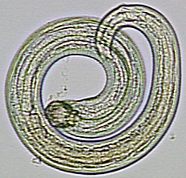

## Exploration and analysis of two infection experiments

Many parasitic worms are trophically-transmitted. That is, they are transmitted when one host is eaten by the next host. It has often been shown that such worms experience 'crowding'; they are smaller when the host is infected by multiple worms. Whether such crowding has consequences for worms, such as reduced infectivity, has been less studied. I conducted experiments exploring this in two worm species, a nematode (*Camallanus lacustris*) and a cestode (*Schistocephalus solidus*). In both experiments, fish were infected with a constant dose of worms, but the worms were distributed differently in their copepod intermediate hosts. Some were from 'crowded' intermediate hosts and others were from 'uncrowded' hosts. This repository contains the data and analyses from these experiments, [here](camallanus/analysis_cam_dat.md) for *Camallanus* and [here](schistocephalus/analysis_schisto_dat.md) for *Schistocephalus*. The main conclusion was that worms from higher-intensity infections did not have significantly reduced infectivity to the next host.

The results have been published in this scientific paper: [Benesh 2018. J. Helminthol.](https://www.cambridge.org/core/journals/journal-of-helminthology/article/crowding-in-the-first-intermediate-host-does-not-affect-infection-probability-in-the-second-host-in-two-helminths/9C23E641ACAE6C4979BBF4ADDB32E7C8).

