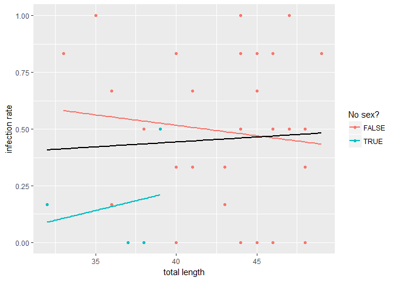
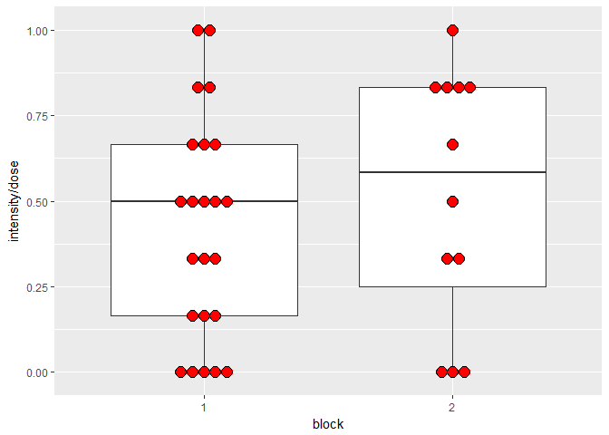
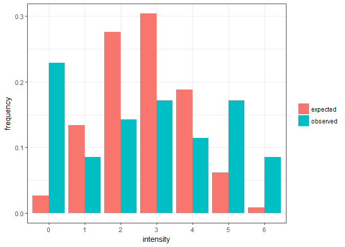
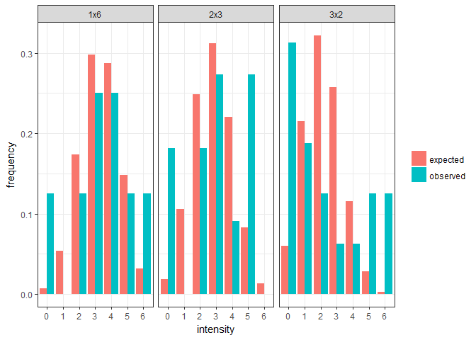
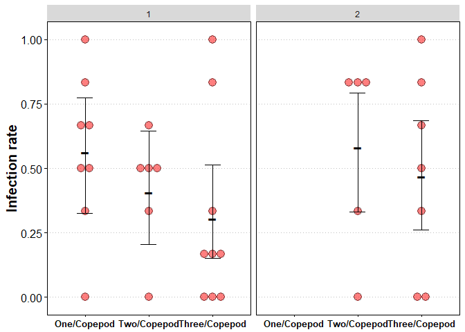
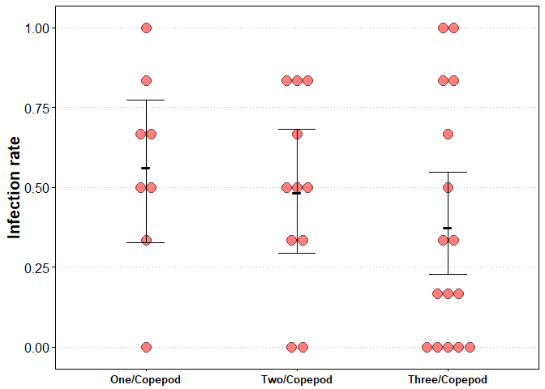

Effect of Camallanus infections
================

**Background**: these data are from an experiment in which stickleback fish were infected with a nematode worm. Fish were each given six worms via a copepod intermediate host. There were three treatments. Fish were either given six worms in six copepods (one worm per copepod), six worms in three copepods (two per copepod), or six worms in two copepods (three per copepod). The goal of the experiment was to determine if crowding in the intermediate host affects a worm's chance of successfully infecting a fish.

**Analysis** Preliminary stuff. Set the wd, import libraries, and look at the data.

``` r
library(ggplot2)
library(dplyr)
library(tidyr)
library(boot)
library(MuMIn)

setwd("C:/Users/phosp/OneDrive/Documents/Benesh/Research/Intensity_infectivity/analysis/camallanus/")

cdat <- read.csv(file = "cam_fish_inf.csv", header = TRUE, sep = ',')
head(cdat)
```

    ##   ï..Fish Fish_family Block Treatment Length Weight Liver.Weight Fish_sex
    ## 1       1 PL098_PL057     1       3x2     36  0.376       0.0108        M
    ## 2       2 PL098_PL057     1       1x6     41  0.507       0.0120        M
    ## 3       3 PL098_PL057     1       1x6     36  0.326       0.0130        F
    ## 4       4 PL098_PL057     1       3x2     33  0.275       0.0075        F
    ## 5       5 PL098_PL057     1       1x6     48  0.741       0.0282        F
    ## 6       6 PL017_PL165     1       2x3     45  0.722       0.0206        M
    ##   Uneaten Dose Intensity
    ## 1       0    6         1
    ## 2       0    6         4
    ## 3       0    6         4
    ## 4       0    6         5
    ## 5       0    6         0
    ## 6       0    6         4

Clean up the data a bit.

``` r
cdat <- select(cdat, block = Block, trt = Treatment, tl = Length, fw = Weight,
               ffam = Fish_family, fsex = Fish_sex, 
               uneaten = Uneaten, dose = Dose, intensity = Intensity)%>%
  mutate(block = factor(block))
# note: there is one fish with an uneaten copepod. This copepod was uninfected, so the dose should have still been 6.
```

See if there is missing data. Some in the fish sex variable.

``` r
sapply(cdat, function(x) sum(is.na(x))) # missing values in each variable
```

    ##     block       trt        tl        fw      ffam      fsex   uneaten 
    ##         0         0         0         0         0         4         0 
    ##      dose intensity 
    ##         0         0

Calculate infection rates for the three treatments. Looks like there might be a trend in the expected direction.

``` r
cd_avg <- group_by(cdat, trt)%>%
  summarize(n = n(), tdose = sum(dose, na.rm=T), tint = sum(intensity, na.rm=T))%>%
  mutate(inf.rate = tint/tdose)%>%
  select(trt, n, inf.rate)
cd_avg 
```

    ## # A tibble: 3 × 3
    ##      trt     n  inf.rate
    ##   <fctr> <int>     <dbl>
    ## 1    1x6     8 0.5625000
    ## 2    2x3    11 0.4848485
    ## 3    3x2    16 0.3750000

Let's start fitting models. The response variable (infection) is a proportion, so we will run a logistic regression. To get an idea of which variables are important, we'll fit many models. All the models will include treatment, because that's what we want to test. But first we need to filter rows with missing values, so that the sample size is constant, regardless of the variables in the model.

``` r
mdat <- filter(cdat, !is.na(fsex)) # remove rows with missing fish sex data; sex was only variable with missing data

global.mod <- glm(cbind(intensity, dose - intensity) ~ trt + block + (tl * fw) + fsex + ffam, 
                  data = mdat, family = 'binomial', na.action = "na.fail") # global model
```

Some fish variables like length and weight might be important, but fish sex appears unimportant.

``` r
model.set <- dredge(global.mod, fixed = 'trt') # only include models with treatment in set
```

    ## Fixed terms are "trt" and "(Intercept)"

``` r
importance(model.set)
```

    ##                      trt  tl   fw   ffam fw:tl block fsex
    ## Importance:          1.00 0.94 0.89 0.73 0.47  0.28  0.19
    ## N containing models:   40   24   24   20    8    20    20

Male and female fishes have similar infection rates, though the fish with missing data for 'sex' might be less susceptible.

``` r
group_by(cdat, fsex)%>%
  summarize(n = n(), tdose = sum(dose, na.rm=T), tint = sum(intensity, na.rm=T))%>%
  mutate(inf.rate = tint/tdose)%>%
  select(fsex, n, inf.rate)
```

    ## # A tibble: 3 × 3
    ##     fsex     n  inf.rate
    ##   <fctr> <int>     <dbl>
    ## 1      F    17 0.5294118
    ## 2      M    14 0.4404762
    ## 3     NA     4 0.1666667

Let's get rid of fish sex and re-fit the model. This uses the full dataset.

``` r
# use full data and re-fit global model
global.mod <- glm(cbind(intensity, dose - intensity) ~ trt + block + (tl * fw) + ffam, 
                  data = cdat, family = 'binomial', na.action = "na.fail")
model.set <- dredge(global.mod, fixed = 'trt') # only include models with treatment in set
```

    ## Fixed terms are "trt" and "(Intercept)"

``` r
importance(model.set)
```

    ##                      trt  block tl   fw   ffam fw:tl
    ## Importance:          1.00 0.74  0.36 0.31 0.26 0.07 
    ## N containing models:   20   10    12   12   10    4

Total length and fish weight are less important now, so it seems like those 4 fish with missing sex values mattered. This is because these fish (blue below) tend to nullify a previously negative relationship (red line) between size and infection.

``` r
ggplot(data = cdat, aes(x = tl, y = intensity/dose, color = is.na(fsex))) + 
  geom_point() + 
  labs(color = "No sex?", y = "infection rate", x = "total length") +
  geom_smooth(se=F, method='lm') + # for subgroups
  geom_smooth(aes(color = NULL), se = FALSE, color = 'black', method = 'lm') # for full dataset
```



This relationship between fish length and infection rate is not particularly convincing. Still, it seems prudent to include a size variable in the final model, because in many host-parasite systems it is important.

Block was the most important variable after eliminating fish sex. Infection rates in block 2 were slightly higher.

``` r
ggplot(cdat, aes(y = intensity/dose, x = block)) + geom_boxplot() + 
  geom_dotplot(fill = 'red', binaxis = 'y', stackdir = 'center')
```



Here are the top 5 models.

``` r
model.set[1:5,]
```

    ## Global model call: glm(formula = cbind(intensity, dose - intensity) ~ trt + block + 
    ##     (tl * fw) + ffam, family = "binomial", data = cdat, na.action = "na.fail")
    ## ---
    ## Model selection table 
    ##     (Int) blc ffm      fw       tl trt df  logLik  AICc delta weight
    ## 2  0.2513   +                        +  4 -81.312 172.0  0.00  0.466
    ## 1  0.2513                            +  3 -83.650 174.1  2.12  0.162
    ## 10 1.3530   +             -0.02583   +  5 -81.050 174.2  2.21  0.154
    ## 6  0.3786   +     -0.2215            +  5 -81.283 174.6  2.68  0.122
    ## 4  0.2970   +   +                    +  6 -80.065 175.1  3.17  0.095
    ## Models ranked by AICc(x)

The best by far is a model with just 'block' and 'treatment'. The second, third, and fourth models have a similar fit (i.e. AICc) and include fish size (either weight or length, but not both) and maybe block.

I think a reasonable 'final' model accounts for block and one measure of fish size, while testing the effect of treatment.

``` r
mod0 <- glm(cbind(intensity, dose - intensity) ~ block + tl + trt, data = cdat, family = 'binomial')
summary(mod0)
```

    ## 
    ## Call:
    ## glm(formula = cbind(intensity, dose - intensity) ~ block + tl + 
    ##     trt, family = "binomial", data = cdat)
    ## 
    ## Deviance Residuals: 
    ##     Min       1Q   Median       3Q      Max  
    ## -3.2427  -1.1771   0.2672   1.3256   4.0041  
    ## 
    ## Coefficients:
    ##             Estimate Std. Error z value Pr(>|z|)   
    ## (Intercept)  1.35280    1.55289   0.871  0.38367   
    ## block2       0.79769    0.35429   2.252  0.02435 * 
    ## tl          -0.02583    0.03574  -0.723  0.46995   
    ## trt2x3      -0.65044    0.41272  -1.576  0.11503   
    ## trt3x2      -1.17004    0.41381  -2.827  0.00469 **
    ## ---
    ## Signif. codes:  0 '***' 0.001 '**' 0.01 '*' 0.05 '.' 0.1 ' ' 1
    ## 
    ## (Dispersion parameter for binomial family taken to be 1)
    ## 
    ##     Null deviance: 121.90  on 34  degrees of freedom
    ## Residual deviance: 111.73  on 30  degrees of freedom
    ## AIC: 172.1
    ## 
    ## Number of Fisher Scoring iterations: 4

There are some significant block and treatment effects in this model. But we should notice the high ratio of residual deviance (111.7) to the residual degrees of freedom (30). This is an indication of overdispersion; the variation in the data is greater than we would expect if the residuals followed a binomial distribution. This is common, and we can see the overdispersion by plotting the observed data next to expectations under the binomial.

``` r
# get expected frequencies, based on binomial, given mean infection rate
mean.inf.rate <- mean(cdat$intensity/cdat$dose, na.rm=T)
expected <- dbinom(0:6, size = 6, prob = mean.inf.rate)

# calculate the proportion of fish with different infection intensities for each treatment
observed <- data.frame( prop.table(table(cdat$intensity)) )
names(observed) <- c('intensity', 'observed')

# combine expected and observed distributions and plot
binom_exp <- cbind(observed, expected)%>%
  gather('dist', 'freq', expected:observed)

ggplot(binom_exp, aes(x = intensity, y = freq, fill = dist)) + 
  geom_bar(stat = 'identity', position = position_dodge()) +
  labs(y = 'frequency', fill = NULL) +
  theme_bw()
```



The histograms shows how there are more extreme values than expected, such as cases where all or none of the worms infected the fish. On reflection, this makes sense. The worms sharing a copepod are not independent from one another. If they are in a "bad" copepod, all the worms may have a reduced chance to infect the next host. We can confirm that this is a significant departure from expectations with a chi-square test.

``` r
# make one-dimensional contingency table
cont.table <- table(cdat$intensity)

# calculate chi-square test; simulation used to get p-value, given small sample sizes
chisq.test(cont.table, p = expected, simulate.p.value = TRUE, B = 10000)
```

    ## 
    ##  Chi-squared test for given probabilities with simulated p-value
    ##  (based on 10000 replicates)
    ## 
    ## data:  cont.table
    ## X-squared = 89.647, df = NA, p-value = 9.999e-05

If worms within a copepod tend to have a shared fate (all succeed or all fail), then we might expect the departure from a binomial distribution to get more pronounced with crowding. Let's compare empirical and expected distributions for each each treatment.

``` r
# get the expected binomial distribution, given the mean in each treatments
expected <- c(dbinom(0:6, size = 6, prob = cd_avg$inf.rate[1]),
              dbinom(0:6, size = 6, prob = cd_avg$inf.rate[2]),
              dbinom(0:6, size = 6, prob = cd_avg$inf.rate[3]))
expected <- data.frame(trt = rep(cd_avg$trt, each = 7), 
                       intensity = factor(rep(0:6, 3)),
                       expected)

# calculate the proportion of fish with different infection intensities for each treatment
observed <- data.frame( prop.table(table(cdat$trt, cdat$intensity), 1) )
names(observed) <- c('trt', 'intensity', 'observed')

# combine expected and observed distributions and plot
binom_exp <- left_join(expected, observed)%>%
  gather('dist', 'freq', expected:observed)

ggplot(binom_exp, aes(x = intensity, y = freq, fill = dist)) + 
  geom_bar(stat = 'identity', position = position_dodge()) +
  labs(y = 'frequency', fill = NULL) +
  facet_wrap(~trt) + theme_bw()
```



The patterns seem consistent with this idea, e.g. there is a noticeable overabundance of high and low intensities in the most crowded treatment (3x2). Let's run chi-square tests for each treatment separately to confirm they differ from the binomial.

``` r
# contingency table
cont.table <- table(cdat$trt, cdat$intensity)

# test if the observed and expected distributions differ for the one per copepod treatment
chisq.test(x = cont.table[1,],
           p = dbinom(0:6, size = 6, prob = cd_avg$inf.rate[1]),
           simulate.p.value = TRUE, B = 10000)
```

    ## 
    ##  Chi-squared test for given probabilities with simulated p-value
    ##  (based on 10000 replicates)
    ## 
    ## data:  cont.table[1, ]
    ## X-squared = 18.753, df = NA, p-value = 0.0456

``` r
# test if the observed and expected distributions differ for the two per copepod treatment
chisq.test(x = cont.table[2,],
           p = dbinom(0:6, size = 6, prob = cd_avg$inf.rate[2]),
           simulate.p.value = TRUE, B = 10000)
```

    ## 
    ##  Chi-squared test for given probabilities with simulated p-value
    ##  (based on 10000 replicates)
    ## 
    ## data:  cont.table[2, ]
    ## X-squared = 22.839, df = NA, p-value = 0.0127

``` r
# test if the observed and expected distributions differ for the three per copepod treatment
chisq.test(x = cont.table[3,],
           p = dbinom(0:6, size = 6, prob = cd_avg$inf.rate[3]),
           simulate.p.value = TRUE, B = 10000)
```

    ## 
    ##  Chi-squared test for given probabilities with simulated p-value
    ##  (based on 10000 replicates)
    ## 
    ## data:  cont.table[3, ]
    ## X-squared = 113.28, df = NA, p-value = 9.999e-05

``` r
# using the option to get a p-value by Monte Carlo simulation is needed given small sample sizes
```

All are significant, and the deviance from the expected distribution (measured by the chi-square statistic) increases with crowding. Low and high intensities are most overrepresented in the most crowded treatment. It is useful to note a divergence from an expected distribution, as it suggests a violation of assumptions (most likely independence in this case). But we are particularly interested in whether distributions in each treatment differ from one another. Again, chi-square can be used to test this (fisher's exact test may be preferable with small sample sizes, but the results are similar with either).

``` r
chisq.test(cont.table, simulate.p.value = TRUE, B = 10000)
```

    ## 
    ##  Pearson's Chi-squared test with simulated p-value (based on 10000
    ##  replicates)
    ## 
    ## data:  cont.table
    ## X-squared = 10.813, df = NA, p-value = 0.6001

It is non-significant. Thus, we are confident that the infection process does not resemble a binomial distribution, and deviation from this distribution increases with crowding. However, it would be premature to conclude that the distribution of infection differs among treatments. This is a reminder that these frequencies are based on small sample sizes and tests of differences are not that powerful. Also, this tests for differences between groups, not for a trend from low to high crowding.

Returning to our modeling approach, in cases like this, where the data are more variable that expected based on the binomial, it is usual to use `'quasibinomial'` as the family argument. The model parameters are unchanged, but their standard errors are inflated in accordance with the amount of overdispersion. Thus, the significance tests are much more conservative.

``` r
mod0 <- glm(cbind(intensity, dose - intensity) ~ block + tl + trt, data = cdat, family = 'quasibinomial')
anova(mod0, test = "F")
```

    ## Analysis of Deviance Table
    ## 
    ## Model: quasibinomial, link: logit
    ## 
    ## Response: cbind(intensity, dose - intensity)
    ## 
    ## Terms added sequentially (first to last)
    ## 
    ## 
    ##       Df Deviance Resid. Df Resid. Dev      F Pr(>F)
    ## NULL                     34     121.90              
    ## block  1   1.6702        33     120.23 0.5510 0.4637
    ## tl     1   0.0293        32     120.20 0.0097 0.9224
    ## trt    2   8.4696        30     111.73 1.3972 0.2629

Now there is no signifant effect of block, fish size, or treatment (treatment was significant before the adjustment for overdispersion).

We came to this model through a brute force kind of approach (i.e. fitting many models). But we can also try to think of justifiable models a priori. Let's fit a couple for comparison.

*Model 1*: only treatment. This assumes that the effects of other variables are randomized across the treatments and will thus not bias treatment effects. That is, there is no need to control for these effects.

``` r
mod1 <- glm(cbind(intensity, dose - intensity) ~ trt, data = cdat, family = 'quasibinomial')
anova(mod1, test = "F")
```

    ## Analysis of Deviance Table
    ## 
    ## Model: quasibinomial, link: logit
    ## 
    ## Response: cbind(intensity, dose - intensity)
    ## 
    ## Terms added sequentially (first to last)
    ## 
    ## 
    ##      Df Deviance Resid. Df Resid. Dev     F Pr(>F)
    ## NULL                    34     121.90             
    ## trt   2    4.969        32     116.93 0.856 0.4344

The treatment effect is not significant. Let's add other variables we want to account for.

*Model 2*: add block. The experimental block has no biological relevance, so it can be fit without much interest in the parameter estimates.

``` r
mod2 <- glm(cbind(intensity, dose - intensity) ~ block + trt, data = cdat, family = 'quasibinomial')
anova(mod2, test = "F")
```

    ## Analysis of Deviance Table
    ## 
    ## Model: quasibinomial, link: logit
    ## 
    ## Response: cbind(intensity, dose - intensity)
    ## 
    ## Terms added sequentially (first to last)
    ## 
    ## 
    ##       Df Deviance Resid. Df Resid. Dev      F Pr(>F)
    ## NULL                     34     121.90              
    ## block  1   1.6702        33     120.23 0.5722 0.4551
    ## trt    2   7.9754        31     112.26 1.3661 0.2700

There are not big differences between blocks, but controlling for it, affects how much deviance is explained by treatment. It is still not significant though.

*Model 3*: only fish variables (except fish sex). The idea here is that we control for fish traits that might affect susceptibility to infection, like size and family background. Only include one measure of fish size (i.e. not both length and weight due to their strong correlation).

``` r
mod3 <- glm(cbind(intensity, dose - intensity) ~ tl + ffam + trt, data = cdat, family = 'quasibinomial')
anova(mod3, test = "F")
```

    ## Analysis of Deviance Table
    ## 
    ## Model: quasibinomial, link: logit
    ## 
    ## Response: cbind(intensity, dose - intensity)
    ## 
    ## Terms added sequentially (first to last)
    ## 
    ## 
    ##      Df Deviance Resid. Df Resid. Dev      F Pr(>F)
    ## NULL                    34     121.90              
    ## tl    1   0.3210        33     121.58 0.1024 0.7512
    ## ffam  2   1.7351        31     119.85 0.2768 0.7602
    ## trt   2   5.6426        29     114.20 0.9002 0.4176

Neither fish length nor family appear very important, and they do not have as much of an impact on the treatment effect.

*Model 4*: a model with both block and fish variables. With more model terms, overdispersion may decrease as more residual deviance is explained. However, even in this larger model the dispersion parameter is about 3 (i.e. it is still a problem).

``` r
mod4 <- glm(cbind(intensity, dose - intensity) ~ block + tl + ffam + trt, data = cdat, family = 'quasibinomial')
anova(mod4, test = "F")
```

    ## Analysis of Deviance Table
    ## 
    ## Model: quasibinomial, link: logit
    ## 
    ## Response: cbind(intensity, dose - intensity)
    ## 
    ## Terms added sequentially (first to last)
    ## 
    ## 
    ##       Df Deviance Resid. Df Resid. Dev      F Pr(>F)
    ## NULL                     34     121.90              
    ## block  1   1.6702        33     120.23 0.5299 0.4727
    ## tl     1   0.0293        32     120.20 0.0093 0.9239
    ## ffam   2   2.2904        30     117.91 0.3633 0.6986
    ## trt    2  11.1397        28     106.77 1.7671 0.1894

Treatment looks more important here, but it is still not significant. Is this larger model an improvement over the simplest model with just treatment? Let's compare the models with a likelihood ratio test.

``` r
anova(mod1, mod4, test = "F") 
```

    ## Analysis of Deviance Table
    ## 
    ## Model 1: cbind(intensity, dose - intensity) ~ trt
    ## Model 2: cbind(intensity, dose - intensity) ~ block + tl + ffam + trt
    ##   Resid. Df Resid. Dev Df Deviance      F Pr(>F)
    ## 1        32     116.93                          
    ## 2        28     106.77  4   10.161 0.8059 0.5319

It is still not a significant improvement. Note: without accounting for overdispersion (using `family = 'binomial'` instead of `family = 'quasibinomial'`), the addition of block is a significant improvement, but then adding more fish variables is not an improvement.

So the modeling exercises above suggest that our non-significant treatment effect is somewhat dependent on block but not fish size. Let's visualize this. We'll plot the model predictions (+- 95% CI) over the data. First, we'll get the model predictions in a form for plotting.

``` r
modp <- glm(cbind(intensity, dose - intensity) ~ trt - 1 + block, data = cdat, family = 'quasibinomial')

# make new dataset for predictions to plot
newdat <- data.frame(trt = rep(levels(cdat$trt), each = 2),
                     block = rep(c("1", "2"), 3))
newdat <- filter(newdat, trt != "1x6" | block != 2) # remove point where no data exist

# make prediction
preddat <- as.data.frame(predict(modp, newdata = newdat, se = T))
preddat <- cbind(newdat, preddat)
preddat <- mutate(preddat,
                  ciu = fit + 1.96 * se.fit,
                  cil = fit - 1.96 * se.fit,
                  trt = factor(trt, labels = c("One/Copepod", "Two/Copepod", "Three/Copepod")))


# need this to overlay data points over means
cdat$trtf <- factor(cdat$trt, labels = c("One/Copepod", "Two/Copepod", "Three/Copepod"))
```

Then we'll plot the data.

``` r
#set a aesthetic theme for plots
theme.o<-theme_update(
  axis.text.y = element_text(colour="black", size = 12),
  axis.text.x = element_text(colour="black", size = 10, face = "bold"),
  axis.title.y = element_text(colour="black", size = 15, angle = 90, face = "bold", lineheight=0.4),
  axis.title.x = element_blank(),
  axis.ticks = element_line(colour="black"),
  panel.border = element_rect(colour = "black",fill=NA),
  panel.grid.minor=element_blank(),
  panel.grid.major.x=element_blank(),
  panel.grid.major=element_line(color="gray",linetype = "dotted"),
  panel.background= element_rect(fill = NA))


ggplot(preddat, aes(x = trt, y = inv.logit(fit))) + 
  geom_dotplot(data = cdat, aes(y = intensity/dose, x = trtf), 
               fill = 'red', alpha = 0.5,
               binaxis = 'y', stackdir = 'center') +
  geom_point(size = 10, shape = "-") +
  geom_errorbar(aes(ymin = inv.logit(cil), ymax = inv.logit(ciu)), width = 0.25) +
  labs(y = "Infection rate") +
  facet_grid(~block)
```



Given that 'block' was not significant, we can also make a simpler plot with just treatment.

``` r
modp <- glm(cbind(intensity, dose - intensity) ~ trt - 1, data = cdat, family = 'quasibinomial')
# make new dataset for predictions to plot
newdat <- data.frame(trt = levels(cdat$trt))
# make prediction
preddat <- as.data.frame(predict(modp, newdata = newdat, se = T))
preddat <- cbind(newdat, preddat)
preddat <- mutate(preddat,
                  ciu = fit + 1.96 * se.fit,
                  cil = fit - 1.96 * se.fit,
                  trt = factor(trt, labels = c("One/Copepod", "Two/Copepod", "Three/Copepod")))

# make a plot
ggplot(preddat, aes(x = trt, y = inv.logit(fit))) + 
  geom_dotplot(data = cdat, aes(y = intensity/dose, x = trtf), 
               fill = 'red', alpha = 0.5,
               binaxis = 'y', stackdir = 'center') +
  geom_point(size = 10, shape = "-") +
  geom_errorbar(aes(ymin = inv.logit(cil), ymax = inv.logit(ciu)), width = 0.25) +
  labs(y = "Infection rate") 
```



**Conclusion**: There is a non-significant trend in the direction we would expect; crowding leads to lower infection probabilities. However, the trend is obscured by substantial variability from fish to fish. For example, unknown differences between the experimental blocks seem relevant. And there is overdispersion: more often than we would expect all the worms infect or none of them do.
