Crowding and Schistocephalus infection probability
================

**Background**: these data are from an experiment in which stickleback fish were infected with a tapeworm. Fish were each given two tapeworm larvae via an intermediate host (a copepod). There were two treatments. Fish were either given two larvae in one copepod (the crowded treatment) or they were given two larvae in two copepods (one larvae per copepod, the uncrowded treatment). The goal of the experiment was to determine if crowding in the intermediate host affects a worm's chance of successfully infecting a fish.

**Analysis** Preliminary stuff. Set the wd, import libraries, and look at the data.

``` r
library(ggplot2)
library(dplyr)
library(tidyr)
library(boot)
library(MuMIn)

sdat <- read.csv(file = "Schisto_double_exposure.csv", header = TRUE, sep = ',')
head(sdat)
```

    ##   Fish_no Clutch Treatment Total.Length Std.Length Fish.weight Inf. Sex
    ## 1       1      S       2+0           45         40       0.774    1   f
    ## 2       2      S       2+0           37         33       0.391    2   f
    ## 3       3      S       2+0           40         35       0.444    2   f
    ## 4       4      S       2+0           37         33       0.367    1   m
    ## 5       5      S       1+1           40         36       0.540    2   f
    ## 6       6      S       1+1           38         34       0.410    2   m
    ##   Worm1 Worm2 Dead Dissected Early.exposure Later.exposure Age_at_diss1
    ## 1 184.7    NA    0 10/5/2010      6/23/2010      6/28/2010          104
    ## 2  73.6  66.0    0 10/5/2010      6/23/2010      6/28/2010          104
    ## 3  62.2  64.8    0 10/5/2010      6/23/2010      6/28/2010          104
    ## 4 113.2    NA    0 10/5/2010      6/23/2010      6/28/2010          104
    ## 5  93.5  62.3    0 10/5/2010      6/23/2010      6/28/2010          104
    ## 6  73.7  58.5    0 10/5/2010      6/23/2010      6/28/2010          104
    ##   Age_at_diss2 Remark
    ## 1           99       
    ## 2           99       
    ## 3           99       
    ## 4           99       
    ## 5           99       
    ## 6           99

Clean up the data a bit.

``` r
sdat <- select(sdat, worm.fam = Clutch, trt = Treatment, tl = Total.Length, fw = Fish.weight, 
               age_diss = Age_at_diss1, fsex = Sex, fdead = Dead, intensity = Inf.)
sdat$dose <- 2 # each fish got two worms
```

Look at which variables have missing data.

``` r
sapply(sdat, function(x) sum(is.na(x))) # missing values in each variable
```

    ##  worm.fam       trt        tl        fw  age_diss      fsex     fdead 
    ##         0         0         1        10         1         0         1 
    ## intensity      dose 
    ##         1         0

One exposed fish was lost and thus has empty values for 'fdead' and 'intensity'. It can be excluded. Beware of using fish weight in models, as it is missing for 10 fish. These fish died before dissections, but months after exposure, so their worms would not have been too small to be overlooked. In fact, all 11 fish that died during the experiment were infected. This is more than expected by chance which suggests parasite-induced mortality.

``` r
d_tab <- table(sdat$fdead, sdat$intensity)
d_tab
```

    ##    
    ##      0  1  2
    ##   0 26 14  6
    ##   1  0  7  4

``` r
chisq.test(d_tab)
```

    ## Warning in chisq.test(d_tab): Chi-squared approximation may be incorrect

    ## 
    ##  Pearson's Chi-squared test
    ## 
    ## data:  d_tab
    ## X-squared = 11.625, df = 2, p-value = 0.00299

Calculate infection rates for the two treatments.

``` r
sd_avg <- filter(sdat, !is.na(intensity))%>% #only select those with intensity data (one fish with missing data)
  group_by(trt)%>%
  summarize(n = n(), tdose = sum(dose, na.rm=T), tint = sum(intensity, na.rm=T))%>%
  mutate(inf.rate = tint/tdose)%>%
  select(trt, n, inf.rate)
sd_avg 
```

    ## # A tibble: 2 x 3
    ##      trt     n  inf.rate
    ##   <fctr> <int>     <dbl>
    ## 1    1+1    27 0.3703704
    ## 2    2+0    30 0.3500000

Does not look like there is a difference, 37% successfully infected in the uncrowded treatment while 35% successfully infected in the crowded treatment.

Let's start fitting models. The response variable (infection) is a proportion, so we will run a logistic regression. To get an idea of which variables are important, we'll fit many models. All the models will include treatment, because that's what we want to test. But first we need to filter rows with missing values, so that the sample size is constant, regardless of the variables in the model.

``` r
mdat <- filter(sdat, !is.na(fw), !is.na(tl), !is.na(intensity))

global.mod <- glm(cbind(intensity, dose - intensity) ~ trt + (tl * fw) + fsex + worm.fam, 
                  data = mdat, family = 'binomial', na.action = "na.fail") # global model
```

Some fish variables like length and weight might be important, but fish sex appears unimportant. Worm family also does not seem important.

``` r
model.set <- dredge(global.mod, fixed = 'trt') # only include models with treatment in set
```

    ## Fixed terms are "trt" and "(Intercept)"

``` r
importance(model.set)
```

    ##                      trt  tl   fw   fw:tl worm.fam fsex
    ## Importance:          1.00 1.00 1.00 0.47  0.25     0.23
    ## N containing models:   20   12   12    4    10       10

Here's the plot of fish length vs infectivity. Larger fish had lower infection rates. Fish size was measured at dissection, so this pattern either reflects small fish being more susceptible or uninfected fish growing larger during the experiment.

``` r
ggplot(data = sdat, aes(y = intensity/dose, x = tl, color = trt)) + 
  geom_point(alpha = 0.5) + 
  geom_smooth(method = 'lm') 
```

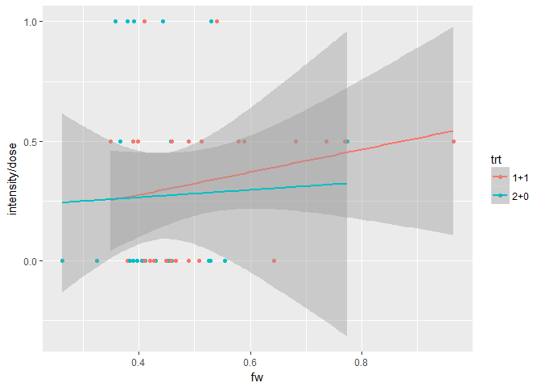

Here's the same plot, but with fish weight.

``` r
ggplot(data = sdat, aes(y = intensity/dose, x = fw, color = trt)) + 
  geom_point() + 
  geom_smooth(method = 'lm') 
```


It increases in heavier fish. This is probably caused by the fact that the fish weight variable also includes worm weight. Let's exclude fish weight, given that this pattern is not convincing and that there was missing data for this variable. The model still includes fish length, which is highly correlated with weight.

``` r
mdat <- filter(sdat, !is.na(tl), !is.na(intensity))

global.mod <- glm(cbind(intensity, dose - intensity) ~ trt + tl + fsex + worm.fam, 
                  data = mdat, family = 'binomial', na.action = "na.fail")
model.set <- dredge(global.mod, fixed = 'trt') # only include models with treatment in set
```

    ## Fixed terms are "trt" and "(Intercept)"

``` r
importance(model.set)
```

    ##                      trt  tl   fsex worm.fam
    ## Importance:          1.00 1.00 0.26 0.24    
    ## N containing models:    8    4    4    4

Now total fish length is the only variable that seems to be important. When we look at the top models, we see that the first three are by far the best (cumulative weight ~ 0.93). They all include fish length. The top model only includes fish length.

``` r
model.set
```

    ## Global model call: glm(formula = cbind(intensity, dose - intensity) ~ trt + tl + 
    ##     fsex + worm.fam, family = "binomial", data = mdat, na.action = "na.fail")
    ## ---
    ## Model selection table 
    ##     (Int) fsx      tl trt wrm.fam df  logLik  AICc delta weight
    ## 3 10.1100     -0.2625   +          3 -53.337 113.1  0.00  0.559
    ## 4 10.7500   + -0.2754   +          4 -53.208 115.2  2.06  0.200
    ## 7 10.1500     -0.2631   +       +  4 -53.335 115.4  2.31  0.176
    ## 8 10.8300   + -0.2767   +       +  5 -53.202 117.6  4.45  0.060
    ## 1 -0.5306               +          2 -59.885 124.0 10.87  0.002
    ## 2 -0.6810   +           +          3 -59.583 125.6 12.49  0.001
    ## 5 -0.6179               +       +  3 -59.780 126.0 12.89  0.001
    ## 6 -0.7809   +           +       +  4 -59.460 127.7 14.56  0.000
    ## Models ranked by AICc(x)

Interpreting this fish length effect is complicated though. Small fish may be more susceptible to *Schistocephalus* infection. Some of my previous studies found negative, but non-significant associations between fish weight at exposure and infectivity (see [here](http://onlinelibrary.wiley.com/doi/10.1111/j.1600-0706.2011.19925.x/full) and [here](http://onlinelibrary.wiley.com/doi/10.1111/evo.12388/full)). However, in this experiment the fish were measured at dissection and not at exposure, so it may simply be that uninfected fish grew more than infected fish, causing the negative relationship. Also, fish were not dissected at the same time. Most fish were dissected around 100 days after exposure, but some died earlier and a few were dissected after ~170 days to have large worms for breeding.

Thus, fish length is a mixture of fish size at exposure, fish growth rate, and fish growth duration. We can at least look at the effect of fish size at a given age at dissection. We can define three age groups: 1) fish dissected about 3 months post exposure (the majority), 2) fish that died before the planned dissection date, and 3) a handful of fish that were dissected after about 5.5 months. When we plot infection rate vs length for these three groups, there is still a negative relationship for the main group ('most fish').

``` r
# make an age factor variable
mdat <- mutate(mdat, age_fac = if_else(age_diss < 100, "dead",
                                       if_else(age_diss < 110, "most fish", "late dissection")))

# plot it
ggplot(data = mdat, aes(y = intensity/dose, x = tl, color = age_fac)) + 
  geom_point(alpha = 0.5) + 
  geom_smooth(method = 'lm')
```

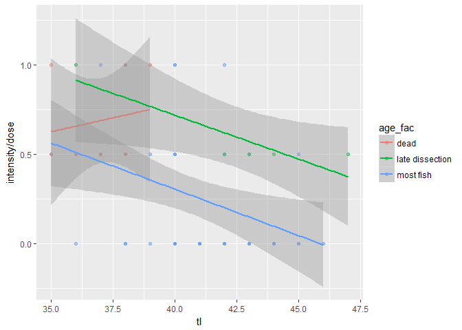

And this negative relationship is significant when we fit a logistic regression with only the majority of fish dissected at about the same time. Treatment effects are still non-significant, though.

``` r
# just fit to fish of same age
modb <- glm(cbind(intensity, dose - intensity) ~ tl + trt, 
            data = filter(mdat, age_fac == "most fish"),
            family = 'binomial')
summary(modb)
```

    ## 
    ## Call:
    ## glm(formula = cbind(intensity, dose - intensity) ~ tl + trt, 
    ##     family = "binomial", data = filter(mdat, age_fac == "most fish"))
    ## 
    ## Deviance Residuals: 
    ##     Min       1Q   Median       3Q      Max  
    ## -1.6993  -0.9800  -0.6064   0.4934   2.7588  
    ## 
    ## Coefficients:
    ##             Estimate Std. Error z value Pr(>|z|)   
    ## (Intercept)  11.2817     4.2908   2.629  0.00856 **
    ## tl           -0.2997     0.1064  -2.817  0.00484 **
    ## trt2+0       -0.4370     0.5142  -0.850  0.39534   
    ## ---
    ## Signif. codes:  0 '***' 0.001 '**' 0.01 '*' 0.05 '.' 0.1 ' ' 1
    ## 
    ## (Dispersion parameter for binomial family taken to be 1)
    ## 
    ##     Null deviance: 69.857  on 43  degrees of freedom
    ## Residual deviance: 60.328  on 41  degrees of freedom
    ## AIC: 82.963
    ## 
    ## Number of Fisher Scoring iterations: 4

Controlling for fish length did not change the treatment differences, which is not surprising given that average fish length was very comparable in the two treatment groups.

``` r
filter(mdat, age_fac == "most fish")%>%
  group_by(trt)%>%
  summarize(n = n(), mean_length = mean(tl, na.rm=T), std_dev_length = sd(tl, na.rm=T))
```

    ## # A tibble: 2 x 4
    ##      trt     n mean_length std_dev_length
    ##   <fctr> <int>       <dbl>          <dbl>
    ## 1    1+1    20    40.80000       2.483631
    ## 2    2+0    24    40.41667       2.888006

So fish size variables are difficult to interpret and have no impact on our main interest, treatment effects. Thus, we do not consider further models including fish size.

Another approach to model-building is to think of appropriate models *a priori* and then compare them. Let's start with the simplest model, with only treatment.

**Model 1**: Just treatment

``` r
mod1 <- glm(cbind(intensity, dose - intensity) ~ trt, data = sdat, family = 'binomial')
summary(mod1)
```

    ## 
    ## Call:
    ## glm(formula = cbind(intensity, dose - intensity) ~ trt, family = "binomial", 
    ##     data = sdat)
    ## 
    ## Deviance Residuals: 
    ##     Min       1Q   Median       3Q      Max  
    ## -1.3603  -1.3127   0.3730   0.4343   2.0492  
    ## 
    ## Coefficients:
    ##             Estimate Std. Error z value Pr(>|z|)  
    ## (Intercept) -0.53063    0.28180  -1.883   0.0597 .
    ## trt2+0      -0.08841    0.39073  -0.226   0.8210  
    ## ---
    ## Signif. codes:  0 '***' 0.001 '**' 0.01 '*' 0.05 '.' 0.1 ' ' 1
    ## 
    ## (Dispersion parameter for binomial family taken to be 1)
    ## 
    ##     Null deviance: 90.709  on 56  degrees of freedom
    ## Residual deviance: 90.658  on 55  degrees of freedom
    ##   (1 observation deleted due to missingness)
    ## AIC: 123.77
    ## 
    ## Number of Fisher Scoring iterations: 4

There is no effect of crowding. Overdispersion seems mild. The ratio of residual deviance to residual degrees of freedom is about 1.6, so we would expect the results to be unaffected by using the argument `family = 'quasibinomial'`.

``` r
mod1 <- glm(cbind(intensity, dose - intensity) ~ trt, data = sdat, family = 'quasibinomial')
summary(mod1)
```

    ## 
    ## Call:
    ## glm(formula = cbind(intensity, dose - intensity) ~ trt, family = "quasibinomial", 
    ##     data = sdat)
    ## 
    ## Deviance Residuals: 
    ##     Min       1Q   Median       3Q      Max  
    ## -1.3603  -1.3127   0.3730   0.4343   2.0492  
    ## 
    ## Coefficients:
    ##             Estimate Std. Error t value Pr(>|t|)  
    ## (Intercept) -0.53063    0.31471  -1.686   0.0974 .
    ## trt2+0      -0.08841    0.43637  -0.203   0.8402  
    ## ---
    ## Signif. codes:  0 '***' 0.001 '**' 0.01 '*' 0.05 '.' 0.1 ' ' 1
    ## 
    ## (Dispersion parameter for quasibinomial family taken to be 1.247232)
    ## 
    ##     Null deviance: 90.709  on 56  degrees of freedom
    ## Residual deviance: 90.658  on 55  degrees of freedom
    ##   (1 observation deleted due to missingness)
    ## AIC: NA
    ## 
    ## Number of Fisher Scoring iterations: 4

``` r
anova(mod1, test = 'F')
```

    ## Analysis of Deviance Table
    ## 
    ## Model: quasibinomial, link: logit
    ## 
    ## Response: cbind(intensity, dose - intensity)
    ## 
    ## Terms added sequentially (first to last)
    ## 
    ## 
    ##      Df Deviance Resid. Df Resid. Dev     F Pr(>F)
    ## NULL                    56     90.709             
    ## trt   1 0.051191        55     90.658 0.041 0.8402

The results are similar. Below we examine the distribution of the data and whether the binomial distribution fits the data well. But first we'll fit a couple more models. To be conservative we will use `family = 'quasibinomial'`

**Model 2**: treatment plus fish variables (just sex, given concerns with fish length discussed above)

``` r
mod2 <- glm(cbind(intensity, dose - intensity) ~ fsex + trt, data = sdat, family = 'quasibinomial')
anova(mod1, mod2, test = "LRT")
```

    ## Analysis of Deviance Table
    ## 
    ## Model 1: cbind(intensity, dose - intensity) ~ trt
    ## Model 2: cbind(intensity, dose - intensity) ~ fsex + trt
    ##   Resid. Df Resid. Dev Df Deviance Pr(>Chi)
    ## 1        55     90.658                     
    ## 2        54     90.054  1  0.60332   0.4912

This is not a significantly better model. Finally, we'll add one more term, worm family (there were two used in the experiment).

**Model 3**: treatment, fish sex, worm family

``` r
mod3 <- glm(cbind(intensity, dose - intensity) ~ fsex + worm.fam + trt, data = sdat, family = 'quasibinomial')
anova(mod2, mod3, test = "LRT")
```

    ## Analysis of Deviance Table
    ## 
    ## Model 1: cbind(intensity, dose - intensity) ~ fsex + trt
    ## Model 2: cbind(intensity, dose - intensity) ~ fsex + worm.fam + trt
    ##   Resid. Df Resid. Dev Df Deviance Pr(>Chi)
    ## 1        54     90.054                     
    ## 2        53     89.808  1   0.2461    0.664

This model is not an improvement, and treatment is still not significant (not shown). Thus, we can conclude that the treatment effect (or lack thereof) is not sensitive to model specifications.

So I think two models can be justified. I prefer a simple model with just `trt`, but a larger model including several control variables `trt + fsex + worm.fam` is also reasonable. Neither suggests that crowding affected establishment probability.

We noted some overdispersion in the logistic regression, so let's look at how well the binomial approximates the observed data distribution.

``` r
# get the expected binomial distribution, given the overall mean infection rate
mean.inf.rate <- mean(sdat$intensity/sdat$dose, na.rm=T)
expected <- dbinom(0:2, size = 2, prob = mean.inf.rate)

# calculate the proportion of fish with different infection intensities for each treatment
observed <- data.frame( prop.table(table(sdat$intensity)) )
names(observed) <- c('intensity', 'observed')

# combine expected and observed distributions and plot
binom_exp <- cbind(observed, expected)%>%
  gather('dist', 'freq', expected:observed)

ggplot(binom_exp, aes(x = intensity, y = freq, fill = dist)) + 
  geom_bar(stat = 'identity', position = position_dodge()) +
  labs(y = 'frequency', fill = NULL) +
  theme_bw()
```

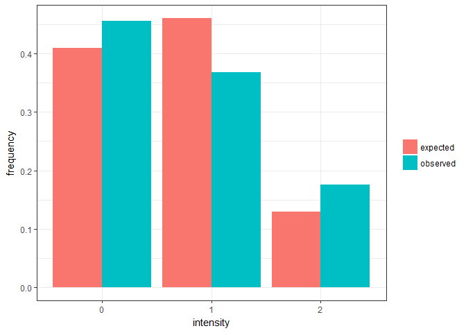

It looks like a reasonable fit, which we can confirm using a chi-square test.

``` r
# make one-dimensional contingency table
cont.table <- table(sdat$intensity)

# calculate chi-square test; simulation used to get p-value, given small sample sizes
chisq.test(cont.table, p = expected, simulate.p.value = TRUE, B = 10000)
```

    ## 
    ##  Chi-squared test for given probabilities with simulated p-value
    ##  (based on 10000 replicates)
    ## 
    ## data:  cont.table
    ## X-squared = 2.283, df = NA, p-value = 0.321

Even though this test is non-significant, it is worth looking at the distribution in each treatment separately. In the crowded treatment, worms are not independent from one another. They may be more likely to all succeed or all fail, which would cause divergence from the expectations under a binomial distribution. This seems to apply to our other experiment with *Camallanus* (see [here](../camallanus/analysis_cam_dat.md)). So let's plot the observed and expected distribution for each treatment separately.

``` r
# get the expected binomial distribution, given the mean in each treatments
expected <- c(dbinom(0:2, size = 2, prob = sd_avg$inf.rate[1]),
              dbinom(0:2, size = 2, prob = sd_avg$inf.rate[2]))
expected <- data.frame(trt = rep(sd_avg$trt, each = 3), 
                       intensity = factor(rep(0:2, 2)),
                       expected)

# calculate the proportion of fish with different infection intensities for each treatment
observed <- data.frame( prop.table(table(sdat$trt, sdat$intensity), 1) )
names(observed) <- c('trt', 'intensity', 'observed')

# combine expected and observed distributions and plot
binom_exp <- left_join(expected, observed)%>%
  gather('dist', 'freq', expected:observed)

ggplot(binom_exp, aes(x = intensity, y = freq, fill = dist)) + 
  geom_bar(stat = 'identity', position = position_dodge()) +
  labs(y = 'frequency', fill = NULL) +
  facet_wrap(~trt) + theme_bw()
```

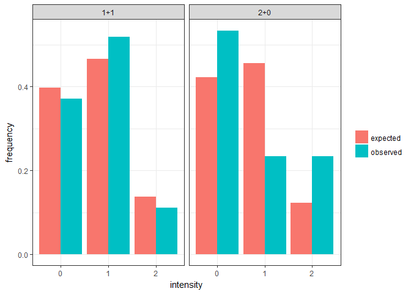

For single infections (uncrowded treatment) it fits quite well. But for fish exposed to doubly-infected copepods, we see more null and double infections than expected. This suggests that when worms share a copepod host, their chance to infect is not independent. That is, both infect or both fail to infect more frequently than expected. We can do chi-square tests to see if these differences are significant.

``` r
# contingency table
cont.table <- table(sdat$trt, sdat$intensity)

# test if the observed and expected distributions differ for the uncrowded treatment
chisq.test(x = cont.table[1,],
           p = dbinom(0:2, size = 2, prob = sd_avg$inf.rate[1]))
```

    ## Warning in chisq.test(x = cont.table[1, ], p = dbinom(0:2, size = 2, prob =
    ## sd_avg$inf.rate[1])): Chi-squared approximation may be incorrect

    ## 
    ##  Chi-squared test for given probabilities
    ## 
    ## data:  cont.table[1, ]
    ## X-squared = 0.33727, df = 2, p-value = 0.8448

``` r
# test if the observed and expected distributions differ for the crowded treatment
chisq.test(x = cont.table[2,],
           p = dbinom(0:2, size = 2, prob = sd_avg$inf.rate[2]))
```

    ## Warning in chisq.test(x = cont.table[2, ], p = dbinom(0:2, size = 2, prob =
    ## sd_avg$inf.rate[2])): Chi-squared approximation may be incorrect

    ## 
    ##  Chi-squared test for given probabilities
    ## 
    ## data:  cont.table[2, ]
    ## X-squared = 7.1203, df = 2, p-value = 0.02843

``` r
# using the option to get a p-value by Monte Carlo simulation yields comparable results
```

The difference is non-significant for the uncrowded treatment, but it is significant for the crowded treatment, suggesting that null and double infections are overrepresented, relative to expectations.

Instead of comparing the distribution of each treatment to the expected binomial distribution, we could compare them to each other. That is are the data distributed differently in the two treatments, even though the means are not different?

``` r
chisq.test(cont.table)
```

    ## Warning in chisq.test(cont.table): Chi-squared approximation may be
    ## incorrect

    ## 
    ##  Pearson's Chi-squared test
    ## 
    ## data:  cont.table
    ## X-squared = 5.1744, df = 2, p-value = 0.07523

This chi-square test is marginally non-significant. So, there is suggestive evidence that the data are distributed differently in the two treatments, despite their similar mean values.

Let's make a couple nice plots that visualize the data.

``` r
# set an aesthetic theme for plots
theme.o<-theme_update(
  axis.text.y = element_text(colour="black", size = 12),
  axis.text.x = element_text(colour="black", size = 12, face = "bold"),
  axis.title.y = element_text(colour="black", size = 15, angle = 90, face = "bold", lineheight=0.4),
  axis.title.x = element_blank(),
  axis.ticks = element_line(colour="black"),
  panel.border = element_rect(colour = "black",fill=NA),
  panel.grid.minor=element_blank(),
  panel.grid.major.x=element_blank(),
  panel.grid.major=element_line(color="gray",linetype = "dotted"),
  panel.background= element_rect(fill = NA))
```

``` r
# create function to extract means and 95% conf. intervals from glm results
get_ci_log_reg <- function(mod) { #takes a fitted logistic regression
  mod_sum <- summary(mod)
  
  # extract parameters and calculate 95% cis
  param <- mod_sum$coefficients[,1]
  se <- mod_sum$coefficients[,2]
  cil <- param - 1.96*se
  ciu <- param + 1.96*se
  
  sd_avg <- data.frame(param, cil, ciu) # make data frame
  sd_avg <- mutate_all(sd_avg, inv.logit) # convert from logistic to proportion
  sd_avg$trt <- names(param) # add parameter names
  
  return(sd_avg)
}
```

First make a plot comparing treatment groups.

``` r
# plot just the average infection rates; no correction for fish length
mod1.1 <- glm(cbind(intensity, dose - intensity) ~ trt - 1, data = sdat, family = 'quasibinomial')

sd_avg <- get_ci_log_reg(mod1.1)
sd_avg <- mutate(sd_avg, trt = factor(trt, labels = c("One/Copepod", "Two/Copepod")))

sdat <- mutate(sdat, trtf = factor(trt, labels = c("One/Copepod", "Two/Copepod"))) # need this var for overlaying data on means

ggplot(sd_avg, aes(x = trt, y = param)) +
  geom_dotplot(data = sdat, aes(y = intensity/dose, x = trtf),
               fill = 'red', alpha = 0.5,
               binaxis = 'y', stackdir = 'center') +
  geom_point(size = 10, shape = "-") +
  geom_errorbar(aes(ymin = cil, ymax = ciu), width = 0.25) +
  labs(y = "Infection rate") +
  scale_y_continuous(limits = c(0,1)) + 
  scale_x_discrete(expand = c(0.25, 0))
```

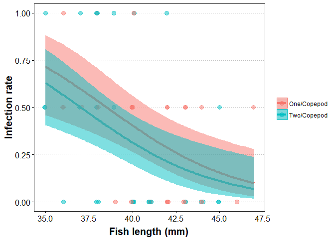

The means (black points) are very similar in the two groups, but the red points show how the distribution of the data might be different in the two treatments.

Given that fish length appeared important, if not easily interpretable, we can plot the effect of both treatment and fish length simultaneously.

``` r
# fit model
mod5 <- glm(cbind(intensity, dose - intensity) ~ trt-1 + tl, data = sdat, family = 'quasibinomial')

# make new dataset for predictions to plot
newdat <- data.frame(tl = rep(seq(min(sdat$tl, na.rm = T), max(sdat$tl, na.rm = T), 0.1), 2))
newdat$trt <- factor(rep(c("1+1", "2+0"), each = length(newdat$tl)/2 ))

# make predictions
preddat <- as.data.frame(predict(mod5, newdata = newdat, se = T))
preddat <- cbind(newdat, preddat)
preddat <- mutate(preddat,
                  ciu = fit + 1.96 * se.fit,
                  cil = fit - 1.96 * se.fit,
                  trt = factor(trt, labels = c("One/Copepod", "Two/Copepod")))

sdat$trtf <- factor(sdat$trt, labels = c("One/Copepod", "Two/Copepod"))


ggplot(sdat, aes(x = tl, y = intensity/dose, color = trtf)) + 
  geom_point(size = 3, alpha = 0.5, 
             position = position_jitter(width = 0.1, height = 0)) +
  geom_line(data = preddat, aes(x = tl, y = inv.logit(fit), color = trt), size = 1.5) +
  geom_ribbon(data = preddat, alpha = 0.5,
              aes(x = tl, 
                  y = inv.logit(fit), 
                  ymin = inv.logit(cil),
                  ymax = inv.logit(ciu),
                  fill = trt, color = NULL)) +
  labs(y = "Infection rate", x = "\nFish length (mm)",
       color = NULL, fill = NULL) +
  theme(axis.title.x = element_text(size = 15, face = "bold", lineheight=0.4),
        axis.text.x = element_text(colour="black", size = 12, face = "plain"))
```

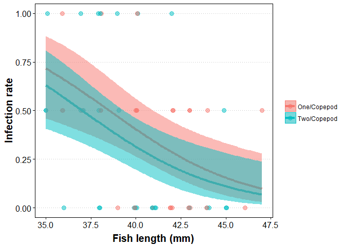

**Conclusion**: There is little support for the hypothesis that crowding reduces the infection rate of these worms. However, there is suggestive evidence that worms from crowded infection are more likely to either both establish or neither establish.

Export figure for manuscript. Size and format have been specified for J. Helminthol.

``` r
p <- ggplot(sd_avg, aes(x = trt, y = param)) +
  geom_dotplot(data = sdat, aes(y = intensity/dose, x = trtf), 
               fill = 'red', alpha = 0.75, dotsize = 1,
               binaxis = 'y', stackdir = 'center') +
  geom_point(size = 10, shape = "-") +
  geom_errorbar(aes(ymin = cil, ymax = ciu), width = 0.25) +
  labs(y = "Infection rate") +
  scale_y_continuous(limits = c(0,1)) + 
  theme(
  axis.text.y = element_text(colour="black", size = 8),
  axis.text.x = element_text(colour="black", size = 8),
  axis.title.y = element_text(colour="black", size = 9, angle = 90),
  axis.title.x = element_blank(),
  axis.ticks = element_line(colour="black"),
  panel.border = element_rect(colour = "black",fill=NA),
  panel.grid.minor=element_blank(),
  panel.grid.major.x=element_blank(),
  panel.grid.major=element_line(color="gray",linetype = "dotted"),
  panel.background= element_rect(fill = NA)
  )

p
```

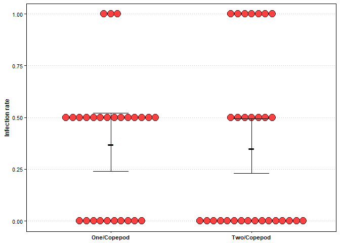

``` r
ggsave(plot = p, filename = "../figs/fig_schisto.tiff", dpi = 800, units = "mm", width = 80, height = 70)
```

**Revisions**

After peer-review, a couple issues were raised. First, a reviewer asked how reliable the intensity measurements are. That is, when we count one worm in a copepod, how certain are we that there is only one worm in the copepod? Mistakes happen, and usually intensities are underestimated because a worm is overlooked. Presumably this happens in all treatments, but maybe it is more common in the crowded treatment, if two worms in a single copepod are hard to distinguish from one another. Let's take an extreme hypothetical, where in every doubly-infected copepod, there was an extra worm lurking unobserved, such that fish were exposed to three instead of two worms. In this case, the infection rate is obviously lower in the crowded treatment, decreasing from 35 to 23%.

``` r
sdat$dose2 <- sdat$dose
sdat$dose2[which(sdat$trtf == "Two/Copepod")] <- 3

sd_avg_hyp <- filter(sdat, !is.na(intensity))%>% #only select those with intensity data (one fish with missing data)
  group_by(trt)%>%
  summarize(n = n(), tdose = sum(dose2, na.rm=T), tint = sum(intensity, na.rm=T))%>%
  mutate(inf.rate = tint/tdose)%>%
  select(trt, n, inf.rate)
sd_avg_hyp
```

    ## # A tibble: 2 x 3
    ##      trt     n  inf.rate
    ##   <fctr> <int>     <dbl>
    ## 1    1+1    27 0.3703704
    ## 2    2+0    30 0.2333333

However, this decrease is still not sufficient to be considered statistically significant in the logistic regression model, though it is getting close at p = 0.1.

``` r
mod_hyp <- glm(cbind(intensity, dose2 - intensity) ~ trt, data = sdat, family = 'quasibinomial')
summary(mod_hyp)
```

    ## 
    ## Call:
    ## glm(formula = cbind(intensity, dose2 - intensity) ~ trt, family = "quasibinomial", 
    ##     data = sdat)
    ## 
    ## Deviance Residuals: 
    ##     Min       1Q   Median       3Q      Max  
    ## -1.3603  -1.2626   0.3730   0.3928   1.9932  
    ## 
    ## Coefficients:
    ##             Estimate Std. Error t value Pr(>|t|)  
    ## (Intercept)  -0.5306     0.2987  -1.776   0.0812 .
    ## trt2+0       -0.6590     0.3988  -1.652   0.1042  
    ## ---
    ## Signif. codes:  0 '***' 0.001 '**' 0.01 '*' 0.05 '.' 0.1 ' ' 1
    ## 
    ## (Dispersion parameter for quasibinomial family taken to be 1.123791)
    ## 
    ##     Null deviance: 79.756  on 56  degrees of freedom
    ## Residual deviance: 76.694  on 55  degrees of freedom
    ##   (1 observation deleted due to missingness)
    ## AIC: NA
    ## 
    ## Number of Fisher Scoring iterations: 4

Intensity errors like this lower mean infection rates, but the hour-glass like shape of the distribution is not changed. It is just compressed towards lower values.

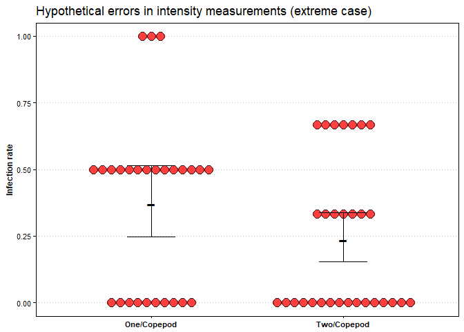

A reviewer also suggested that crowding may have subtler, longer-term effects. In the case of *S.solidus*, we can examine whether worm size at dissection depends on crowding treatment. To do so, we need to re-import the data and retain worm size in the data table.

``` r
sdat <- read.csv(file = "Schisto_double_exposure.csv", header = TRUE, sep = ',')
names(sdat)
```

    ##  [1] "Fish_no"        "Clutch"         "Treatment"      "Total.Length"  
    ##  [5] "Std.Length"     "Fish.weight"    "Inf."           "Sex"           
    ##  [9] "Worm1"          "Worm2"          "Dead"           "Dissected"     
    ## [13] "Early.exposure" "Later.exposure" "Age_at_diss1"   "Age_at_diss2"  
    ## [17] "Remark"

``` r
sdat <- select(sdat, worm.fam = Clutch, trt = Treatment, tl = Total.Length, fw = Fish.weight, 
               age_diss = Age_at_diss1, fsex = Sex, fdead = Dead, intensity = Inf.,
               Worm1, Worm2)%>%
  mutate(tot_ww = if_else(is.na(Worm2), Worm1, Worm1 + Worm2))
```

We'll focus on the total weight of the worms in a fish. Worm weight is affected by fish size and age at dissection. To make apples-apples comparisons, let's take the largest subset of comparable fish: those that survived and were dissected at the main time point (~100 dpi).

``` r
# take just infected fish, dissected at main time point
sdat_size <- filter(sdat, fdead != 1, age_diss < 150, !is.na(tot_ww))
```

This leaves just 16 fish to compare. Moreover, these fish need to be split by infection intensity, as worm weight may differ between fish with one or two worms. As can be seen on the boxplot below, this leaves very few fish in each group (from 2 to 7). There is no clear trend for worms from doubly-infected copepods to be smaller than those from singly-infected copepods.

``` r
sdat_size$fint <- factor(sdat_size$intensity, labels = c("One Worm/Fish", "Two Worms/Fish"))
ggplot(sdat_size, aes(x = trt, y = tot_ww)) + 
  geom_boxplot() +
  geom_jitter() +
  labs(x = "Intensity in copepods", y = "Worm weight") +
  facet_grid(~fint) +
  theme(axis.title.x = element_text())
```

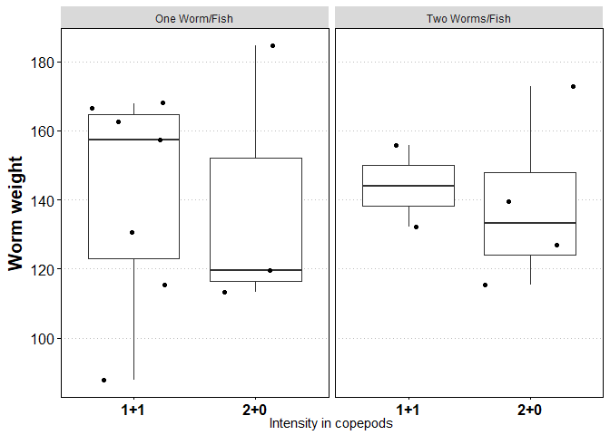

We should account for another covariate: fish size. Worms are bigger in bigger fish, as can be seen in the next plot. However, it does not look like worms from doubly-infected copepods tend to be smaller than expected, given their host's size and the intensity of infection.

``` r
ggplot(sdat_size, aes(x = tl, y = tot_ww, color = trt)) + 
  geom_point() +
  labs(x = "Fish length", y = "Worm weight", color = "Intensity in copepods") +
  facet_grid(~fint) +
  theme(axis.title.x = element_text())
```

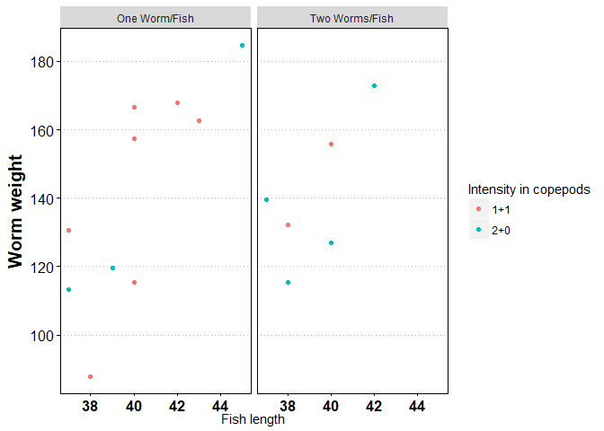

Perhaps unsurprisingly, given the previous plots and the small sample sizes, there is not a significant effect of treatment in a glm with fish length and fish infection intensity.

``` r
summary(glm(tot_ww ~ tl + intensity + trt, data = sdat_size))
```

    ## 
    ## Call:
    ## glm(formula = tot_ww ~ tl + intensity + trt, data = sdat_size)
    ## 
    ## Deviance Residuals: 
    ##     Min       1Q   Median       3Q      Max  
    ## -35.147   -7.993    3.224   10.065   25.111  
    ## 
    ## Coefficients:
    ##             Estimate Std. Error t value Pr(>|t|)   
    ## (Intercept) -240.117     89.665  -2.678  0.02011 * 
    ## tl             9.271      2.156   4.300  0.00103 **
    ## intensity     10.772     10.730   1.004  0.33525   
    ## trt2+0        -6.052     10.259  -0.590  0.56618   
    ## ---
    ## Signif. codes:  0 '***' 0.001 '**' 0.01 '*' 0.05 '.' 0.1 ' ' 1
    ## 
    ## (Dispersion parameter for gaussian family taken to be 359.9364)
    ## 
    ##     Null deviance: 11010.2  on 15  degrees of freedom
    ## Residual deviance:  4319.2  on 12  degrees of freedom
    ## AIC: 144.98
    ## 
    ## Number of Fisher Scoring iterations: 2

Another reviewer comment concerned the marginal significance of differences in infection rate distributions in the crowded and uncrowded treatments. It seemed like there were more all-or-none infections in the crowded treatments, but the pattern was not significant. Let's explore how much more divergent the distributions would need to be to become significant at the sample sizes in our experiment. We will take the observed distribution of infections in the uncrowded group, and then diverge the distribution from this observed one. Here's the observed distribution of intensities in singly-infected copepods.

``` r
obs1 <- filter(sdat, trt == "1+1", !is.na(fdead))%>%select(intensity)
obs1 <- as.numeric(table(obs1$intensity)/length(obs1$intensity))
obs1
```

    ## [1] 0.3703704 0.5185185 0.1111111

Now we will slowly increase the proportion of zero and double infections, relative to single infections. Essentially, I am making the distribution more bimodal, which is what we expect if parasites sharing a copepod either all infect or all fail. The next chunk creates two plots demonstrating how I change the distribution from 'no difference' to 'large difference'. The means are kept constant, only the distribution is changing, which is what we observed when comparing crowded and uncrowded groups.

``` r
move_from_middle <- c(0, 0.5) # percentage points to move from single to double and zero infections.

for(m in move_from_middle) { 
  hyp2 <- c(obs1[1] + m/2, obs1[2] - m, obs1[3] + m/2) # proportion in the intensities for doubly-infected cops
  
  # make data frame, including observed values and divergence from them
  singles <- data.frame(intensity = 0:2, singly_infected = obs1)
  doubles <- data.frame(intensity = 0:2, doubly_infected = hyp2)
  d <- left_join(singles, doubles)
  binom_exp <- gather(d, 'dist', 'freq', singly_infected:doubly_infected)
  
  # make plots
  p <- paste0("powerplot", m, sep = "_")
  ggplot(binom_exp, aes(x = intensity, y = freq, fill = dist)) + 
    geom_bar(stat = 'identity', position = position_dodge()) +
    labs(y = 'frequency', fill = NULL) + guides(fill = FALSE) +
    scale_y_continuous(limits = c(0, 0.65), breaks = seq(0,0.65,0.1)) +
    theme_bw()
  ggsave(filename = paste0("../figs/", p, ".png"), device = 'png', width = 5, height = 5)
}
```

Now, we incrementally increase the difference between the distributions, perform a chi-square, and record the p-value to make a plot. The infection rate distribution for singly-infected copepods is that observed in the experiment and is kept constant, while the distribution for doubly-infected copepods is made more and more bimodal.

``` r
trt1_d <- (filter(sdat, trt == "1+1", !is.na(fdead))%>%select(intensity))$intensity # observed dist for singly-infs
make_bimodal <- seq(0, to = max(obs1), by = 0.05) # sequence to make more and more bimodal

for(i in seq_along(make_bimodal)){
  if(i == 1 & exists("out_dat")) {rm(out_dat)} # if out_dat exists on first iteration, delete it
  
  m <- make_bimodal[i]
  hyp2 <- c(obs1[1] + m/2, obs1[2] - m, obs1[3] + m/2) # distribution for doubly-infecteds
  
  trt2_d <- round(hyp2 * 30, 0)
  trt2_d <- rep(0:2, times = trt2_d) # hypothetical data for doubly-infecteds
  
  trt <- rep(c("One/Copepod", "Two/Copepod"), times = c(length(trt1_d), length(trt2_d)))
  d_chi <- data.frame(trt = trt, intensity = c(trt1_d, trt2_d)) # data frame to make contingency table
  
  cont_table <- table(d_chi$trt, d_chi$intensity) # contingency table for chi-square
  
  x <- chisq.test(cont_table, simulate.p.value = TRUE, B = 1000)
  out_row <- data.frame(conditionalness = m, p = x$p.value)
  
  if(i == 1){ # make output dataframe containing 'bimodalness' and p value
    out_dat <- out_row
  } else {
    out_dat <- rbind(out_dat, out_row)
  }
} 
```

Now let's plot how p-values change as the distributions diverge and the 'crowded' distribution gets more bimodal. The bimodalness of the infection was 0.28, i.e. for crowded infections there was 28 fewer percentage points in the single intensity group than expected. This was on the borderline of significance.

``` r
p <- ggplot(out_dat, aes(x = conditionalness, y = p)) +
  geom_point() +
  labs(x = "Divergence from singly-infecteds\n'Bimodalness'",
       y = "Chi-square p-value") +
  geom_smooth(se = F, linetype = "dashed", color = "darkgray") + 
  theme_bw()
p
```

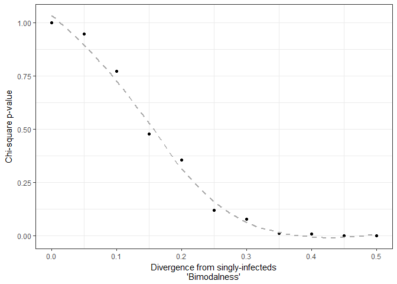

Here's the same plot, but with histograms as insets to show how the distribution becomes more bimodal at the differenct extremes of the x-axis. This shows how a slightly more bimodal pattern in the doubly-infected treatment would have produced a signficant difference.

``` r
library(magick)
library(grid)
img <- image_read(path = "../figs/powerplot0_.png")
img <- image_border(img, color = "black")

img2 <- image_read(path = "../figs/powerplot0.5_.png")
img2 <- image_border(img2, color = "black")

p + annotation_custom(rasterGrob(img), xmin = 0, xmax = 0.15, ymin = 0.025, ymax = 0.55) +
  annotation_custom(rasterGrob(img2), xmin = 0.35, xmax = 0.5, ymin = 0.025, ymax = 0.55)
```

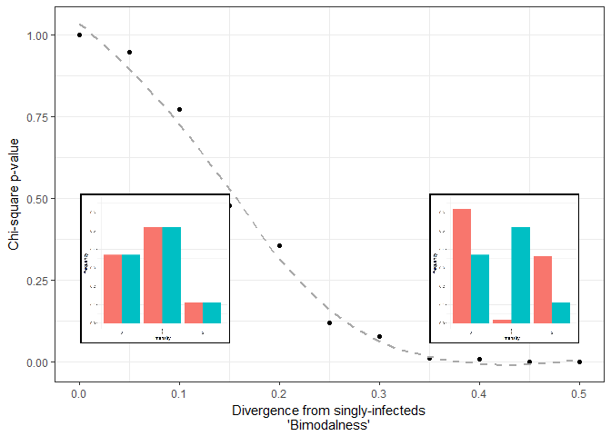
