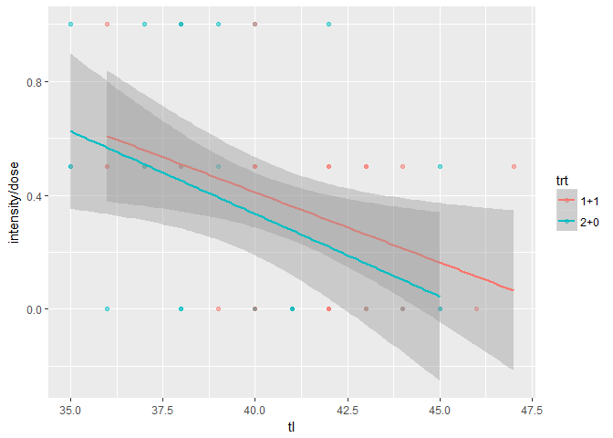
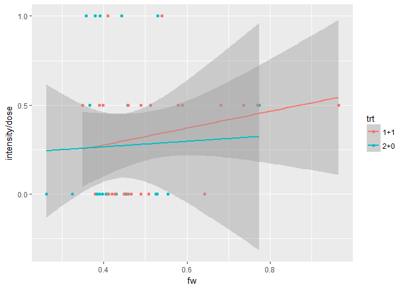
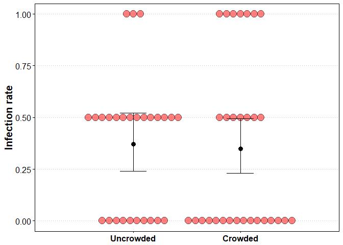
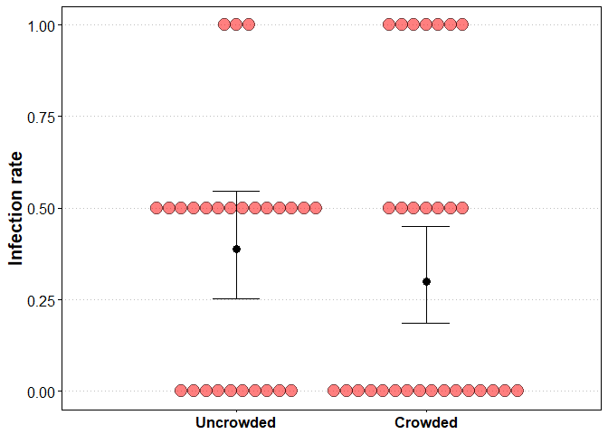
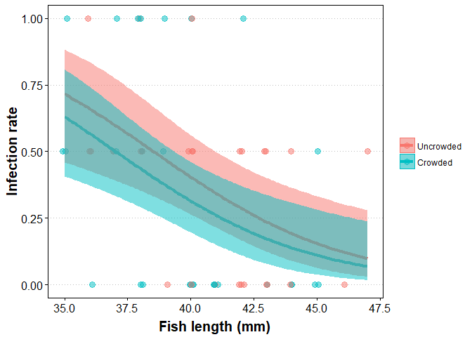

# Analysis of Schisto double infections

**Background**: these data are from an experiment in which stickleback fish were infected with a tapeworm. Fish were each given two tapeworm larvae via an intermediate host (a copepod). There were two treatments. Fish were either given two larvae in one copepod (the crowded treatment) or they were given two larvae in two copepods (one larvae per copepod, the uncrowded treatment). The goal of the experiment was to determine if crowding in the intermediate host affects a worm's chance of successfully infecting a fish.

**Analysis**
Preliminary stuff. Set the wd, import libraries, and look at the data.


```r
library(ggplot2)
library(dplyr)
library(tidyr)
library(boot)
library(MuMIn)

setwd("C:/Users/phosp/OneDrive/Documents/Benesh/Research/Intensity_infectivity/analysis/schistocephalus/")

sdat <- read.csv(file = "Schisto_double_exposure.csv", header = TRUE, sep = ',')
head(sdat)
```

```
##   Fish_no Clutch Treatment Total.Length Std.Length Fish.weight Inf. Sex
## 1       1      S       2+0           45         40       0.774    1   f
## 2       2      S       2+0           37         33       0.391    2   f
## 3       3      S       2+0           40         35       0.444    2   f
## 4       4      S       2+0           37         33       0.367    1   m
## 5       5      S       1+1           40         36       0.540    2   f
## 6       6      S       1+1           38         34       0.410    2   m
##   Worm1 Worm2 Dead Dissected Early.exposure Later.exposure Age_at_diss1
## 1 184.7    NA    0 10/5/2010      6/23/2010      6/28/2010          104
## 2  73.6  66.0    0 10/5/2010      6/23/2010      6/28/2010          104
## 3  62.2  64.8    0 10/5/2010      6/23/2010      6/28/2010          104
## 4 113.2    NA    0 10/5/2010      6/23/2010      6/28/2010          104
## 5  93.5  62.3    0 10/5/2010      6/23/2010      6/28/2010          104
## 6  73.7  58.5    0 10/5/2010      6/23/2010      6/28/2010          104
##   Age_at_diss2 Remark
## 1           99       
## 2           99       
## 3           99       
## 4           99       
## 5           99       
## 6           99
```

Clean up the data a bit.


```r
sdat <- select(sdat, worm.fam = Clutch, trt = Treatment, tl = Total.Length, fw = Fish.weight, 
               fsex = Sex, fdead = Dead, intensity = Inf.)
sdat$dose <- 2 # each fish got two worms
```

Look at which variables have missing data.


```r
sapply(sdat, function(x) sum(is.na(x))) # missing values in each variable
```

```
##  worm.fam       trt        tl        fw      fsex     fdead intensity 
##         0         0         1        10         0         1         1 
##      dose 
##         0
```

One exposed fish was lost and thus has empty values for 'fdead' and 'intensity'. It can be excluded. Beware of using fish weight in models, as it is missing for 10 fish. These fish died before dissections, but months after exposure, so their worms would not have been too small to be overlooked.

Calculate infection rates for the two treatments.


```r
sd_avg <- filter(sdat, !is.na(intensity))%>% #only select those with intensity data (one fish with missing data)
  group_by(trt)%>%
  summarize(n = n(), tdose = sum(dose, na.rm=T), tint = sum(intensity, na.rm=T))%>%
  mutate(inf.rate = tint/tdose)%>%
  select(trt, n, inf.rate)
sd_avg 
```

```
## # A tibble: 2 × 3
##      trt     n  inf.rate
##   <fctr> <int>     <dbl>
## 1    1+1    27 0.3703704
## 2    2+0    30 0.3500000
```

Does not look like there is a difference, 37% successfully infected in the uncrowded treatment while 35% successfully infected in the crowded treatment. 

Let's start fitting models. The response variable (infection) is a proportion, so we will run a logistic regression. To get an idea of which variables are important, we'll fit many models. All the models will include treatment, because that's what we want to test. But first we need to filter rows with missing values, so that the sample size is constant, regardless of the variables in the model.


```r
mdat <- filter(sdat, !is.na(fw), !is.na(tl), !is.na(intensity))

global.mod <- glm(cbind(intensity, dose - intensity) ~ trt + (tl * fw) + fsex + worm.fam, 
                  data = mdat, family = 'binomial', na.action = "na.fail") # global model
```

Some fish variables like length and weight might be important, but fish sex appears unimportant. Worm family also does not seem important. 


```r
model.set <- dredge(global.mod, fixed = 'trt') # only include models with treatment in set
```

```
## Fixed terms are "trt" and "(Intercept)"
```

```r
importance(model.set)
```

```
##                      trt  tl   fw   fw:tl worm.fam fsex
## Importance:          1.00 1.00 1.00 0.47  0.25     0.23
## N containing models:   20   12   12    4    10       10
```

Here's the plot of fish length vs infectivity. Larger fish had lower infection rates. This is either because small fish are more susceptible or because uninfected fish grow longer.


```r
ggplot(data = sdat, aes(y = intensity/dose, x = tl, color = trt)) + 
  geom_point(alpha = 0.5) + 
  geom_smooth(method = 'lm') 
```

<!-- -->

Here's the same plot, but with fish weight.


```r
ggplot(data = sdat, aes(y = intensity/dose, x = fw, color = trt)) + geom_point() + geom_smooth(method = 'lm') 
```

<!-- -->

It increases in heavier fish, but that pattern is not very convincing. Let's exclude fish weight, given that there was missing data for this variable, then re-fit the model. The model still includes fish length, which is highly correlated with weight.


```r
mdat <- filter(sdat, !is.na(tl), !is.na(intensity))

global.mod <- glm(cbind(intensity, dose - intensity) ~ trt + tl + fsex + worm.fam, 
                  data = mdat, family = 'binomial', na.action = "na.fail")
model.set <- dredge(global.mod, fixed = 'trt') # only include models with treatment in set
```

```
## Fixed terms are "trt" and "(Intercept)"
```

```r
importance(model.set)
```

```
##                      trt  tl   fsex worm.fam
## Importance:          1.00 1.00 0.26 0.24    
## N containing models:    8    4    4    4
```

Now total fish length is the only other variable that seems to be important. When we look at the top models, we see that the first three are by far the best (cumulative weight ~ 0.93). They all include fish length. The top model only includes fish length.


```r
model.set
```

```
## Global model call: glm(formula = cbind(intensity, dose - intensity) ~ trt + tl + 
##     fsex + worm.fam, family = "binomial", data = mdat, na.action = "na.fail")
## ---
## Model selection table 
##     (Int) fsx      tl trt wrm.fam df  logLik  AICc delta weight
## 3 10.1100     -0.2625   +          3 -53.337 113.1  0.00  0.559
## 4 10.7500   + -0.2754   +          4 -53.208 115.2  2.06  0.200
## 7 10.1500     -0.2631   +       +  4 -53.335 115.4  2.31  0.176
## 8 10.8300   + -0.2767   +       +  5 -53.202 117.6  4.45  0.060
## 1 -0.5306               +          2 -59.885 124.0 10.87  0.002
## 2 -0.6810   +           +          3 -59.583 125.6 12.49  0.001
## 5 -0.6179               +       +  3 -59.780 126.0 12.89  0.001
## 6 -0.7809   +           +       +  4 -59.460 127.7 14.56  0.000
## Models ranked by AICc(x)
```

Thus, the 'best' model seems to just include fish length and treatment.


```r
modb <- glm(cbind(intensity, dose - intensity) ~ tl + trt, data = sdat, family = 'binomial')
summary(modb)
```

```
## 
## Call:
## glm(formula = cbind(intensity, dose - intensity) ~ tl + trt, 
##     family = "binomial", data = sdat)
## 
## Deviance Residuals: 
##     Min       1Q   Median       3Q      Max  
## -1.8301  -1.0992  -0.3745   0.8081   2.4858  
## 
## Coefficients:
##             Estimate Std. Error z value Pr(>|z|)    
## (Intercept) 10.11322    3.16921   3.191 0.001417 ** 
## tl          -0.26250    0.07825  -3.355 0.000795 ***
## trt2+0      -0.39315    0.42581  -0.923 0.355859    
## ---
## Signif. codes:  0 '***' 0.001 '**' 0.01 '*' 0.05 '.' 0.1 ' ' 1
## 
## (Dispersion parameter for binomial family taken to be 1)
## 
##     Null deviance: 90.709  on 56  degrees of freedom
## Residual deviance: 77.561  on 54  degrees of freedom
##   (1 observation deleted due to missingness)
## AIC: 112.67
## 
## Number of Fisher Scoring iterations: 4
```

```r
anova(modb, test = "Chi")
```

```
## Analysis of Deviance Table
## 
## Model: binomial, link: logit
## 
## Response: cbind(intensity, dose - intensity)
## 
## Terms added sequentially (first to last)
## 
## 
##      Df Deviance Resid. Df Resid. Dev  Pr(>Chi)    
## NULL                    56     90.709              
## tl    1  12.2859        55     78.423 0.0004564 ***
## trt   1   0.8619        54     77.561 0.3532190    
## ---
## Signif. codes:  0 '***' 0.001 '**' 0.01 '*' 0.05 '.' 0.1 ' ' 1
```

This model suggests that infection decreases in bigger fish, and that there is no effect of crowding. Overdispersion seems mild. The ratio of residual deviance to residual degrees of freedom is about 1.4, so we would expect the results to be unaffected by using the argument `family = 'quasibinomial'`.


```r
modb <- glm(cbind(intensity, dose - intensity) ~ tl + trt, data = sdat, family = 'quasibinomial')
summary(modb)
```

```
## 
## Call:
## glm(formula = cbind(intensity, dose - intensity) ~ tl + trt, 
##     family = "quasibinomial", data = sdat)
## 
## Deviance Residuals: 
##     Min       1Q   Median       3Q      Max  
## -1.8301  -1.0992  -0.3745   0.8081   2.4858  
## 
## Coefficients:
##             Estimate Std. Error t value Pr(>|t|)   
## (Intercept) 10.11322    3.42734   2.951  0.00468 **
## tl          -0.26250    0.08463  -3.102  0.00306 **
## trt2+0      -0.39315    0.46050  -0.854  0.39702   
## ---
## Signif. codes:  0 '***' 0.001 '**' 0.01 '*' 0.05 '.' 0.1 ' ' 1
## 
## (Dispersion parameter for quasibinomial family taken to be 1.169533)
## 
##     Null deviance: 90.709  on 56  degrees of freedom
## Residual deviance: 77.561  on 54  degrees of freedom
##   (1 observation deleted due to missingness)
## AIC: NA
## 
## Number of Fisher Scoring iterations: 4
```

And the results are similar. We can also look at how well the binomial approximates the actual distribution.


```r
# get the expected binomial distribution, given the mean in each treatments
expected <- c(dbinom(0:2, size = 2, prob = sd_avg$inf.rate[1]),
              dbinom(0:2, size = 2, prob = sd_avg$inf.rate[2]))
expected <- data.frame(trt = rep(sd_avg$trt, each = 3), 
                       intensity = factor(rep(0:2, 2)),
                       expected)

# calculate the proportion of fish with different infection intensities for each treatment
observed <- data.frame( prop.table(table(sdat$trt, sdat$intensity), 1) )
names(observed) <- c('trt', 'intensity', 'observed')

# combine expected and observed distributions and plot
binom_exp <- left_join(expected, observed)%>%
  gather('dist', 'freq', expected:observed)

ggplot(binom_exp, aes(x = intensity, y = freq, fill = dist)) + 
  geom_bar(stat = 'identity', position = position_dodge()) +
  labs(y = 'frequency', fill = NULL) +
  facet_wrap(~trt) + theme_bw()
```

<!-- -->

For single infections it does quite well. But for fish exposed to doubly-infected copepods, we see more null and double infections than expected. This suggests that when worms share a copepod host, their chance to infect is not independent. We can do chi-square tests to see if these differences are significant. First, we'll confirm that the uncrowded treatment is well-approximated by the binomial.


```r
# contingency table
cont.table <- table(sdat$trt, sdat$intensity)

# test if the observed and expected distributions differ for the uncrowded treatment
chisq.test(x = cont.table[1,],
           p = dbinom(0:2, size = 2, prob = sd_avg$inf.rate[1]))
```

```
## Warning in chisq.test(x = cont.table[1, ], p = dbinom(0:2, size = 2, prob =
## sd_avg$inf.rate[1])): Chi-squared approximation may be incorrect
```

```
## 
## 	Chi-squared test for given probabilities
## 
## data:  cont.table[1, ]
## X-squared = 0.33727, df = 2, p-value = 0.8448
```

```r
# using the option to get a p-value by Monte Carlo simulation yields comparable results
```

The difference is non-significant. Now, we'll check in the crowded treatment. It is marginally significant, suggesting that null and double infections are overrepresented.


```r
# test if the observed and expected distributions differ for the crowded treatment
chisq.test(x = cont.table[2,],
           p = dbinom(0:2, size = 2, prob = sd_avg$inf.rate[2]))
```

```
## Warning in chisq.test(x = cont.table[2, ], p = dbinom(0:2, size = 2, prob =
## sd_avg$inf.rate[2])): Chi-squared approximation may be incorrect
```

```
## 
## 	Chi-squared test for given probabilities
## 
## data:  cont.table[2, ]
## X-squared = 7.1203, df = 2, p-value = 0.02843
```

```r
# using the option to get a p-value by Monte Carlo simulation yields comparable but slightly more conservative results
```

Instead of comparing the distribution of each treatment to the expected binomial distribution, we could compare them to each other.


```r
chisq.test(cont.table, simulate.p.value = TRUE)
```

```
## 
## 	Pearson's Chi-squared test with simulated p-value (based on 2000
## 	replicates)
## 
## data:  cont.table
## X-squared = 5.1744, df = NA, p-value = 0.09195
```

This chi-square test is marginally non-significant. So, there is suggestive evidence that the data are distributed differently in the two treatments, despite their similar mean values. This is an interesting observation, but it is something we would like to confirm with more data.


Another approach to model-building is to think of appropriate models a priori and then compare them. Since we want to test the effect of our experimental treatment, we'll fit a couple models that attempt to control for other variables, and then see whether or not there is an effect of treatment. To be conservative, we'll account for overdispersion.

*Model 1*: Just test treatment


```r
mod1 <- glm(cbind(intensity, dose - intensity) ~ trt, data = sdat, family = 'quasibinomial')
anova(mod1, test = "Chi")
```

```
## Analysis of Deviance Table
## 
## Model: quasibinomial, link: logit
## 
## Response: cbind(intensity, dose - intensity)
## 
## Terms added sequentially (first to last)
## 
## 
##      Df Deviance Resid. Df Resid. Dev Pr(>Chi)
## NULL                    56     90.709         
## trt   1 0.051191        55     90.658   0.8395
```

*Model 2*: treatment plus fish variables (length and sex)


```r
mod2 <- glm(cbind(intensity, dose - intensity) ~ tl + fsex + trt, data = sdat, family = 'quasibinomial')
anova(mod1, mod2, test = "LRT")
```

```
## Analysis of Deviance Table
## 
## Model 1: cbind(intensity, dose - intensity) ~ trt
## Model 2: cbind(intensity, dose - intensity) ~ tl + fsex + trt
##   Resid. Df Resid. Dev Df Deviance Pr(>Chi)   
## 1        55     90.658                        
## 2        53     77.304  2   13.354 0.003436 **
## ---
## Signif. codes:  0 '***' 0.001 '**' 0.01 '*' 0.05 '.' 0.1 ' ' 1
```

This is a significantly better model, because fish size affects susceptibility. However, the experimental treatment is still not significant.


```r
anova(mod2, test = "Chi")
```

```
## Analysis of Deviance Table
## 
## Model: quasibinomial, link: logit
## 
## Response: cbind(intensity, dose - intensity)
## 
## Terms added sequentially (first to last)
## 
## 
##      Df Deviance Resid. Df Resid. Dev Pr(>Chi)   
## NULL                    56     90.709            
## tl    1  12.2859        55     78.423 0.001233 **
## fsex  1   0.1143        54     78.309 0.755323   
## trt   1   1.0045        53     77.304 0.355545   
## ---
## Signif. codes:  0 '***' 0.001 '**' 0.01 '*' 0.05 '.' 0.1 ' ' 1
```

Finally, we'll add one more term to the model, worm family (there were two used in the experiment). This is the same 'global' model we used to derive a model set previously.

*Model 3*: treatment, fish variables, worm family

```r
mod3 <- glm(cbind(intensity, dose - intensity) ~ tl + fsex + worm.fam + trt, data = sdat, family = 'quasibinomial')
anova(mod2, mod3, test = "LRT")
```

```
## Analysis of Deviance Table
## 
## Model 1: cbind(intensity, dose - intensity) ~ tl + fsex + trt
## Model 2: cbind(intensity, dose - intensity) ~ tl + fsex + worm.fam + trt
##   Resid. Df Resid. Dev Df Deviance Pr(>Chi)
## 1        53     77.304                     
## 2        52     77.291  1  0.01293   0.9173
```

This model is not an improvement, and treatment is still not significant (not shown). Thus, we can conclude that the treatment effect is not altered by other variables. 

So I think two models can be justifed. The full model `trt + tl + fsex + worm.fam` because it simply includes all the variables we presumed could be important. Or a reduced model `trt + tl` which only includes length (a variable that matters) and treatment (the variable we are interested in testing).

Let's make a couple publishable plots that visualize the data.


```r
# set an aesthetic theme for plots
theme.o<-theme_update(
  axis.text.y = element_text(colour="black", size = 12),
  axis.text.x = element_text(colour="black", size = 12, face = "bold"),
  axis.title.y = element_text(colour="black", size = 15, angle = 90, face = "bold", lineheight=0.4),
  axis.title.x = element_blank(),
  axis.ticks = element_line(colour="black"),
  panel.border = element_rect(colour = "black",fill=NA),
  panel.grid.minor=element_blank(),
  panel.grid.major.x=element_blank(),
  panel.grid.major=element_line(color="gray",linetype = "dotted"),
  panel.background= element_rect(fill = NA))
```


```r
# create function to extract means and 95% conf. intervals from glm results
get_ci_log_reg <- function(mod) { #takes a fitted logistic regression
  mod_sum <- summary(mod)
  
  # extract parameters and calculate 95% cis
  param <- mod_sum$coefficients[,1]
  se <- mod_sum$coefficients[,2]
  cil <- param - 1.96*se
  ciu <- param + 1.96*se
  
  sd_avg <- data.frame(param, cil, ciu) # make data frame
  sd_avg <- mutate_all(sd_avg, inv.logit) # convert from logistic to proportion
  sd_avg$trt <- names(param) # add parameter names
  
  return(sd_avg)
}
```

First make a plot with the unconditional means, without correcting for fish length.


```r
# plot just the average infection rates; no correction for fish length
mod1.1 <- glm(cbind(intensity, dose - intensity) ~ trt - 1, data = sdat, family = 'quasibinomial')

sd_avg <- get_ci_log_reg(mod1.1)
sd_avg <- mutate(sd_avg, trt = factor(trt, labels = c("Uncrowded", "Crowded")))

sdat <- mutate(sdat, trtf = factor(trt, labels = c("Uncrowded", "Crowded"))) # need this var for overlaying data on means

ggplot(sd_avg, aes(x = trt, y = param)) +
  geom_dotplot(data = sdat, aes(y = intensity/dose, x = trtf),
               fill = 'red', alpha = 0.5,
               binaxis = 'y', stackdir = 'center') +
  geom_point(size = 3) +
  geom_errorbar(aes(ymin = cil, ymax = ciu), width = 0.25) +
  labs(y = "Infection rate") +
  scale_y_continuous(limits = c(0,1)) + 
  scale_x_discrete(expand = c(0.25, 0))
```

<!-- -->

The means (black points) are very similar in the two groups, but the red points show how the distribution of the data might be different in the two treatments.

Now let's make a plot with the correction for fish length, i.e. show infection rates for an 'average fish'. Difference is slightly bigger, but still not significant.


```r
sdat <- mutate(sdat, cen.tl = tl - mean(tl, na.rm = T)) #make centered tl variable

mod4.1 <- glm(cbind(intensity, dose - intensity) ~ trt-1 + cen.tl, data = sdat, family = 'quasibinomial')

sd_avg <- get_ci_log_reg(mod4.1)
sd_avg <- filter(sd_avg, trt != "cen.tl")%>%
  mutate(trt = factor(trt, labels = c("Uncrowded", "Crowded")))


ggplot(sd_avg, aes(x = trt, y = param)) +
  geom_dotplot(data = sdat, aes(y = intensity/dose, x = trtf),
               fill = 'red', alpha = 0.5,
               binaxis = 'y', stackdir = 'center') +
  geom_point(size = 3) +
  geom_errorbar(aes(ymin = cil, ymax = ciu), width = 0.25) +
  labs(y = "Infection rate") +
  scale_y_continuous(limits = c(0,1)) + 
  scale_x_discrete(expand = c(0.25, 0))
```

<!-- -->


Finally, we can plot the effect of both treatment and fish length simultaneously.


```r
# fit model
mod5 <- glm(cbind(intensity, dose - intensity) ~ trt-1 + tl, data = sdat, family = 'quasibinomial')

# make new dataset for predictions to plot
newdat <- data.frame(tl = rep(seq(min(sdat$tl, na.rm = T), max(sdat$tl, na.rm = T), 0.1), 2))
newdat$trt <- factor(rep(c("1+1", "2+0"), each = length(newdat$tl)/2 ))

# make predictions
preddat <- as.data.frame(predict(mod5, newdata = newdat, se = T))
preddat <- cbind(newdat, preddat)
preddat <- mutate(preddat,
                  ciu = fit + 1.96 * se.fit,
                  cil = fit - 1.96 * se.fit,
                  trt = factor(trt, labels = c("Uncrowded", "Crowded")))

sdat$trtf <- factor(sdat$trt, labels = c("Uncrowded", "Crowded"))


ggplot(sdat, aes(x = tl, y = intensity/dose, color = trtf)) + 
  geom_point(size = 3, alpha = 0.5, 
             position = position_jitter(width = 0.1, height = 0)) +
  geom_line(data = preddat, aes(x = tl, y = inv.logit(fit), color = trt), size = 1.5) +
  geom_ribbon(data = preddat, alpha = 0.5,
              aes(x = tl, 
                  y = inv.logit(fit), 
                  ymin = inv.logit(cil),
                  ymax = inv.logit(ciu),
                  fill = trt, color = NULL)) +
  labs(y = "Infection rate", x = "\nFish length (mm)",
       color = NULL, fill = NULL) +
  theme(axis.title.x = element_text(size = 15, face = "bold", lineheight=0.4),
        axis.text.x = element_text(colour="black", size = 12, face = "plain"))
```

<!-- -->

**Conclusion**: There is little support for the hypothesis that crowding reduces the infection rate of these worms. However, it is possible that worms from crowded intermediate hosts are more likely to either both establish or neither establish. This needs further study. Also, larger fish were less susceptible to infection.
